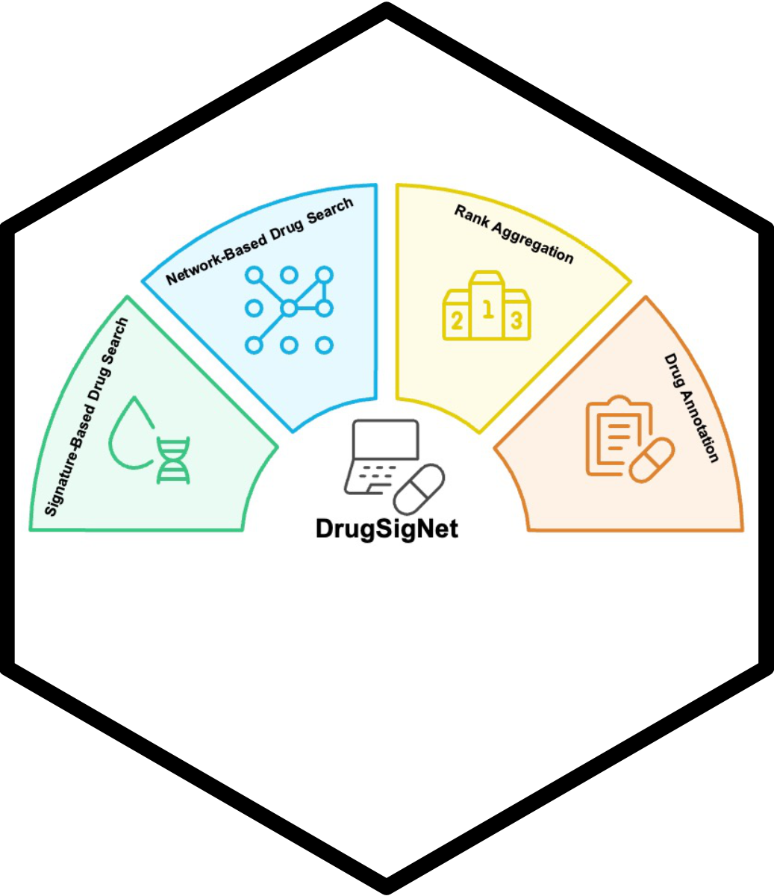

# DrugSigNet

[](https://cran.r-project.org/web/licenses/MIT%20%2B%20file%20LICENSE)
[](https://github.com/compneurobio/DrugSigNet)
[](https://github.com/compneurobio/DrugSigNet/actions)
[](https://hub.docker.com/u/orhan1117)



DrugSigNet is an R package for reproducible *in silico* drug repurposing using disease signatures, biological networks, and consensus ranking.

The package supports three common analysis scenarios: signature-based drug search from differential expression data, network-based prioritization from disease genes, and integrated workflows that combine both evidence types. DrugSigNet also provides tools for drug annotation, enrichment analysis, and visualization of prioritized candidates.

## Why DrugSigNet?

DrugSigNet helps users move from disease evidence to prioritized and interpretable drug candidates in a modular workflow. It provides:

- **Signature-based drug search** using CMAP, LINCS, gCMAP, and correlation-based scoring.
- **Network-based prioritization** using TrustRank, harmonic centrality, degree centrality, network proximity, and diffusion-based scoring.
- **Consensus ranking** using CRank, Dowdall, and Robust Rank Aggregation.
- **Drug annotation** for mechanisms of action, indications, ATC classes, drug status, blood-brain-barrier information, clinical trials, and adverse events.
- **Visualization helpers** for ranked candidates, method agreement, overlaps, enrichment, and annotation summaries.
- **Export and reporting** with multi-sheet Excel output and HTML/PDF analysis reports.

## Choosing a workflow

| If you have... | Start with... | Main output |
|---|---|---|
| A signed differential expression signature with `Entrez` and `FC` columns | `drugSignaturePipeline()` | Signature-based drug rankings and consensus results |
| Disease-associated genes but no signed expression signature | `drugNetworkPipeline()` | Network-based drug rankings from disease genes and interaction networks |
| Both expression and disease-gene evidence | `drugRepurposingPipeline(mode = "both")` | Integrated signature-network rankings |
| A candidate drug list from any source | `annotate_drugs()` | Drug metadata, mechanisms, indications, status, safety, and trial context |
| Completed rankings or annotations | Visualization helpers or `run_visualization = TRUE` | Plots for method agreement, overlap, enrichment, annotation, and similarity |
| A completed pipeline result | `write_pipeline_results()` or `write_report()` | Excel workbooks or HTML/PDF analysis reports |

For a first test run, set `run_drug_annotation = FALSE` and `run_visualization = FALSE`. Re-enable annotation and visualization after confirming that the core ranking workflow runs successfully.

## Installation

Install the development version from GitHub:

```r
if (!requireNamespace("BiocManager", quietly = TRUE)) {
  install.packages("BiocManager", repos = "https://cloud.r-project.org")
}
if (!requireNamespace("devtools", quietly = TRUE)) {
  install.packages("devtools", repos = "https://cloud.r-project.org")
}

options(repos = BiocManager::repositories())
devtools::install_github("compneurobio/DrugSigNet", dependencies = TRUE)
```

This command installs the declared dependencies (including optional packages
available from their declared repositories) and can also build the vignettes in
the same transaction:

```r
devtools::install_github(
  "compneurobio/DrugSigNet",
  dependencies = TRUE,
  build_vignettes = TRUE
)
```

Alternatively, install with `pak`:

```r
if (!requireNamespace("pak", quietly = TRUE)) {
  install.packages("pak", repos = "https://cloud.r-project.org")
}

pak::pak("compneurobio/DrugSigNet")
```

Load the package:

```r
library(DrugSigNet)
```

### Optional dependencies

Some workflows require additional setup:

- **Synapse-backed data** requires a Synapse personal access token and the
  `synapser` package. DrugSigNet installs it automatically when a Synapse-backed
  function is first called. Keeping it out of `Suggests` prevents
  `dependencies = TRUE` from installing incompatible `rjson 0.2.23` before
  Synapser. To install and validate Synapse support in advance, use:

  ```r
  DrugSigNet::setup_synapser()
  ```

  The helper installs Synapser's required `rjson 0.2.21` directly from the CRAN
  archive, installs Synapser without re-resolving that dependency, and verifies
  that its namespace loads. Set
  `options(DrugSigNet.auto_install_synapser = FALSE)` before a Synapse call to
  disable automatic installation.
- **Graph-tool-backed network methods** require a Python/conda environment with `graph-tool` available through `reticulate`.
- **Fully reproducible local execution** is supported through Docker.

For local Python, Synapse, and Docker details, see [`DOCKER.md`](DOCKER.md), the vignettes, and the helper script `tools/install_local_drugsignet.R` in the repository.

## Quick start

### Signature-based workflow

Run a small signature-based workflow from a two-column disease signature.

```r
library(DrugSigNet)

signature_input <- data.frame(
  Entrez = c("7157", "5290", "1956", "7422", "4609", "207"),
  FC = c(2.1, -1.4, 1.8, -2.2, 1.3, -1.7)
)

signature_result <- drugSignaturePipeline(
  signature_input = signature_input,
  top_k = 50,
  n_workers = 1,
  run_drug_annotation = FALSE,
  run_visualization = FALSE
)
```

### Network-based workflow

Run a network-based workflow from disease genes.

```r
disease_genes <- c("TP53", "PIK3CA", "EGFR", "VEGFA", "AKT1")

network_result <- drugNetworkPipeline(
  disease_genes = disease_genes,
  run_all_network_methods = FALSE,
  top_k = 50,
  run_drug_annotation = FALSE,
  run_visualization = FALSE
)
```

### Integrated workflow

Combine signature and disease-gene evidence in one workflow.

```r
repurposing_result <- drugRepurposingPipeline(
  signature_input = signature_input,
  disease_genes = disease_genes,
  mode = "both",
  run_all_network_methods = FALSE,
  top_k = 50,
  run_drug_annotation = FALSE,
  run_visualization = FALSE
)
```

## Input requirements

| Workflow component | Required input | Notes |
|---|---|---|
| Signature workflow | Data frame with `Entrez` and `FC` columns | Include both positive and negative fold-change values |
| Network workflow | Non-empty disease gene vector or data frame | Custom networks can be supplied with `ppi_network` and `drug_target_network` |
| Custom PPI network | Data frame with `gene1` and `gene2` columns | Use identifiers consistent with disease genes and drug targets |
| Custom drug-target network | Data frame with `ID`, `Drug`, `Target`, and `Group` columns | Targets should use the same identifier system as the PPI network |
| Annotation workflow | Character vector or data frame of drug names | Synapse-backed annotation data may require `SYNAPSE_AUTH_TOKEN` |
| Visualization workflow | Ranking, annotation, enrichment, or similarity tables | Required columns depend on the selected plotting function |

## Main functions

| Function | Purpose |
|---|---|
| `drugSignaturePipeline()` | Run signature-based drug repurposing from differential expression signatures |
| `drugNetworkPipeline()` | Run network-based prioritization from disease genes and interaction networks |
| `drugRepurposingPipeline()` | Run signature, network, or integrated workflows |
| `annotate_drugs()` | Add drug metadata, mechanisms, indications, safety, and trial information |
| `CRank()`, `Dowdall()`, `RRA()` | Aggregate method-specific rankings into consensus rankings |
| Visualization helpers | Generate plots for ranked drugs, method agreement, overlaps, enrichment, and annotation summaries |
| `write_pipeline_results()` | Export available pipeline tables to a multi-sheet Excel workbook |
| `write_report()` | Generate HTML/PDF reports from one or more pipeline results |

## Export and reporting

Completed pipeline results can be exported to Excel or summarized as an
HTML/PDF report:

```r
write_pipeline_results(
  result_obj = repurposing_result,
  file_path = "DrugSigNet_results.xlsx",
  top_n = 100
)

write_report(
  object = repurposing_result,
  file = "DrugSigNet_report",
  device = "html",
  interactive = TRUE
)
```

Set `write_results = TRUE` in `write_report()` to create the Excel export
alongside the report. See the complete case-study vignette for additional
examples and reporting options.

## Documentation

After installation, open the package vignettes with:

```r
browseVignettes("DrugSigNet")
```

Recommended reading order:

1. [Getting started](vignettes/getting-started.Rmd)
2. [Choosing an analysis strategy](vignettes/choosing-analysis-strategy.Rmd)
3. [Signature methods](vignettes/signature-methods.Rmd)
4. [Network methods](vignettes/network-methods.Rmd)
5. [Rank aggregation](vignettes/rank-aggregation.Rmd)
6. [Drug annotation](vignettes/drug-annotation.Rmd)
7. [Visualization](vignettes/visualization.Rmd)
8. [Signature workflow](vignettes/signature-workflow.Rmd)
9. [Network workflow](vignettes/network-workflow.Rmd)
10. [Complete case study](vignettes/complete-case-study.Rmd)

For function-level documentation, load the package and use:

```r
?drugSignaturePipeline
?drugNetworkPipeline
?drugRepurposingPipeline
?write_pipeline_results
?write_report
```

## Docker

Docker is recommended when users want a reproducible DrugSigNet environment without manually installing R, system libraries, Python modules, or optional network dependencies.

### Use a pre-built Docker image

Pre-built DrugSigNet Docker images for Linux, macOS, and Windows are available from the [`orhan1117` Docker Hub account](https://hub.docker.com/u/orhan1117). Pull the image corresponding to your platform:

**Linux**

```bash
docker pull orhan1117/drugsignet:linux
```

**macOS**

```bash
docker pull orhan1117/drugsignet:mac
```

**Windows**

```powershell
docker pull orhan1117/drugsignet:windows
```

The `docker pull` command downloads the selected image to the local Docker installation. If the image is already present, Docker checks for and retrieves a newer version when available.

### Run RStudio Server

After pulling the image, start the container for your platform.

**Linux**

```bash
docker run --rm -p 8787:8787 -e PASSWORD=drugsignet orhan1117/drugsignet:linux
```

**macOS**

```bash
docker run --rm -p 8787:8787 -e PASSWORD=drugsignet orhan1117/drugsignet:mac
```

**Windows (PowerShell)**

```powershell
docker run --rm -p 8787:8787 -e PASSWORD=drugsignet orhan1117/drugsignet:windows
```

Open <http://localhost:8787> in a web browser and sign in with username `rstudio` and password `drugsignet`.

To run R directly instead of RStudio Server, use:

```bash
docker run --rm -it orhan1117/drugsignet:linux R
```

Replace `linux` with `mac` or `windows` when using the corresponding image.

### Build the image locally

Users who prefer to build DrugSigNet from source can build the Linux image from the repository root:

```bash
docker buildx build --load -f docker/linux/Dockerfile -t drugsignet:linux .
```

For platform-specific builds, configuration, and troubleshooting, see [`DOCKER.md`](DOCKER.md).
The repository includes `docker/macos/build.sh` for Apple Silicon and Intel
macOS hosts, plus `docker/windows/build.ps1` for Docker Desktop on Windows.

## Synapse annotation data

Annotation-enabled workflows can use DrugSigNet annotation data from Synapse. Set a Synapse personal access token before downloading annotation data:

```r
Sys.setenv(SYNAPSE_AUTH_TOKEN = "your-token")
annotation_data <- load_synapse_data(
  auth_token = Sys.getenv("SYNAPSE_AUTH_TOKEN")
)
```

Synapse support is optional and is not required for the minimal signature or network examples above.

## Citation

If DrugSigNet contributes to your analysis or publication, please cite the package. Citation metadata is available in [`CITATION.cff`](CITATION.cff).

## Issues and feature requests

Please report bugs, questions, and feature requests through [GitHub issues](https://github.com/compneurobio/DrugSigNet/issues).

## Website

The package source and development version are available at <https://github.com/compneurobio/DrugSigNet>.
