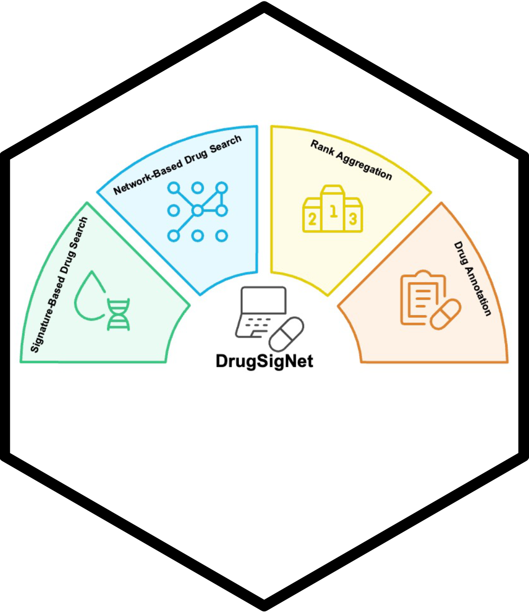

# DrugSigNet

[](https://cran.r-project.org/web/licenses/MIT%20%2B%20file%20LICENSE)
[](https://github.com/compneurobio/DrugSigNet)
[](https://github.com/compneurobio/DrugSigNet/actions)
[](https://hub.docker.com/u/orhan1117)



DrugSigNet is an R package for reproducible *in silico* drug repurposing using disease signatures, biological networks, and consensus ranking.

The package supports three common analysis scenarios: signature-based drug search from differential expression data, network-based prioritization from disease genes, and integrated workflows that combine both evidence types. DrugSigNet also provides tools for drug annotation, enrichment analysis, and visualization of prioritized candidates.

## Why DrugSigNet?

DrugSigNet helps users move from disease evidence to prioritized and interpretable drug candidates in a modular workflow. It provides:

- **Signature-based drug search** using CMAP, LINCS, gCMAP, and correlation-based scoring.
- **Network-based prioritization** using TrustRank, harmonic centrality, degree centrality, network proximity, and diffusion-based scoring.
- **Consensus ranking** using CRank, Dowdall, and Robust Rank Aggregation.
- **Drug annotation** for mechanisms of action, indications, ATC classes, drug status, blood-brain-barrier information, clinical trials, and adverse events.
- **Visualization helpers** for ranked candidates, method agreement, overlaps, enrichment, and annotation summaries.
- **Export and reporting** with multi-sheet Excel output and HTML/PDF analysis reports.

## Choosing a workflow

| If you have... | Start with... | Main output |
|---|---|---|
| A signed differential expression signature with `Entrez` and `FC` columns | `drugSignaturePipeline()` | Signature-based drug rankings and consensus results |
| Disease-associated genes but no signed expression signature | `drugNetworkPipeline()` | Network-based drug rankings from disease genes and interaction networks |
| Both expression and disease-gene evidence | `drugRepurposingPipeline(mode = "both")` | Integrated signature-network rankings |
| A candidate drug list from any source | `annotate_drugs()` | Drug metadata, mechanisms, indications, status, safety, and trial context |
| Completed rankings or annotations | Visualization helpers or `run_visualization = TRUE` | Plots for method agreement, overlap, enrichment, annotation, and similarity |
| A completed pipeline result | `write_pipeline_results()` or `write_report()` | Excel workbooks or HTML/PDF analysis reports |

For a first test run, set `run_drug_annotation = FALSE` and `run_visualization = FALSE`. Re-enable annotation and visualization after confirming that the core ranking workflow runs successfully.

## Installation

DrugSigNet requires **R 4.5.0 or newer**. R 4.0.5 is tied to an obsolete
Bioconductor release and cannot resolve the current `signatureSearch`
dependency stack. Upgrade the R runtime before installing DrugSigNet; changing
`build = FALSE` does not repair an incompatible Bioconductor dependency graph.

Check the runtime before installation:

```r
R.version.string
stopifnot(getRversion() >= "4.5.0")
```

For a bare Debian/Ubuntu/Rocker container, install the development version as
`root` with `pak`. On supported Linux distributions, `pak` resolves and installs
system requirements such as `zlib1g-dev` before compiling the R dependencies:

```r
if (!requireNamespace("pak", quietly = TRUE)) {
  install.packages("pak", repos = sprintf(
    "https://r-lib.github.io/p/pak/stable/%s/%s/%s",
    .Platform$pkgType,
    R.Version()$os,
    R.Version()$arch
  ))
}

options(timeout = max(1200, getOption("timeout", 60)))
options(pkg.sysreqs = TRUE, pkg.build_vignettes = TRUE)
Sys.setenv(PKG_SYSREQS = "true", PKG_BUILD_VIGNETTES = "true")

pak::pkg_install(
  "orhanbellur/DrugSigNet",
  dependencies = NA,
  upgrade = FALSE,
  ask = FALSE
)
```

`pkg.build_vignettes = TRUE` is required for GitHub/source installations made
with `pak`. Without it, `browseVignettes("DrugSigNet")` can display an index
derived from the source files even though the linked HTML files were not
installed, resulting in an RStudio Server “requested page was not found” error.
Reinstall with this option enabled if an existing installation has that symptom.

To install a branch, append the branch after `@` while retaining the GitHub
owner and repository. For example:

```r
pak::pkg_install(
  "orhanbellur/DrugSigNet@codex/verify-drugsignet-installation-dependencies-etqtuy",
  dependencies = NA,
  upgrade = FALSE,
  ask = FALSE
)
```

Do not pass only `"codex/verify-drugsignet-installation-dependencies-etqtuy"`.
`pak` interprets a two-component reference as `owner/repository`, so that value
asks GitHub for an owner named `codex` and a repository named after the branch.

`signatureSearch` remains a declared DrugSigNet import and is installed
automatically; no separate dependency-install command is required.
`dependencies = NA` installs the required dependencies without pulling every
development `Suggests` package. The longer timeout prevents large annotation
downloads from failing at R's 60-second default.

Packages used automatically by annotation, enrichment, and the default
visualization payload (`enrichR`, `data.table`, `ggalluvial`, `ggforce`,
`plotly`, and `wordcloud`) are hard imports. Consequently, the normal
installation includes them and a pipeline requested with
`run_drug_annotation = TRUE` or `run_visualization = TRUE` does not fail later
because an automatically invoked feature was classified as optional.

Parallel R tasks use base R's PSOCK clusters on Linux, macOS, Windows,
containers, and scheduler-allocated HPC sessions. Each worker is a clean R
process with the parent library paths and required namespaces loaded explicitly.
This intentionally avoids Unix fork workers, which inherit HDF5, Java, and
reticulate native state and can block or crash. Worker counts are capped by the
task count and physical cores; single-worker runs remain sequential. On an HPC
system, request CPU cores from the scheduler first and set `n_workers` no higher
than that allocation.

When `n_workers > 1`, signature tasks run in pairs: one task reads CMAP and the
other reads LINCS2, so concurrent workers never open the same HDF5 reference.
The PSOCK cluster is stopped and recreated after every pair, releasing HDF5
handles and resident worker memory before the next methods start. Execution is
capped at two workers because there are two independent reference databases.
`signature_refdb_mode = "frozen"` remains recommended because it resolves both
immutable paths before workers start. The 5.9 GB LINCS2 reference and working
matrices still require an adequate Docker/HPC memory allocation.

Automatic Linux system-package installation requires either a root R process
or passwordless `sudo`. In a Dockerfile, run the command after `USER root`.
When neither privilege is available, `pak` reports the required OS packages but
cannot modify the host operating system.

For an interactive `rocker/rstudio` container, opt in to passwordless sudo when
starting the container:

```bash
docker run --rm -p 8787:8787 \
  -e PASSWORD=drugsignet \
  -e ROOT=TRUE \
  rocker/rstudio:4.5.2
```

Then sign in as `rstudio` and run the `pak::pkg_install()` command above. If an
already-running container was started without `ROOT=TRUE`, recreate it with
that setting or perform the installation as root with `docker exec --user root`.
The message `Executing sudo ... apt-get` followed by `System command 'sudo'
failed` means the RStudio user was not granted that privilege; it is not an R or
Bioconductor dependency-resolution error.

The bootstrap uses pak's self-contained pre-built repository rather than the
CRAN source tarball. This is necessary on a bare Rocker image: compiling pak's
embedded `curl` package from source already needs `libcurl4-openssl-dev`, while
the pre-built pak binary has no system-library bootstrap dependency.

During `R CMD INSTALL`, DrugSigNet's `configure` script also installs Miniconda
when necessary, creates the `r-drugsignet` environment, installs the complete
Python stack (including `graph-tool` on Linux and macOS). Native Windows
installation provisions conda, Python, reticulate-backed modules, Kaleido, and
the Synapse client but skips `graph-tool`, which is not available for Windows.
The selected conda Python is persisted in `~/.Renviron`. The installer also
installs Synapser 3.x directly from its checked-out GitHub source with upstream
vignette rebuilding disabled. Thus
the GitHub command above produces a ready-to-run installation
rather than postponing external dependencies until the first analysis. Set
`DRUGSIGNET_SKIP_RUNTIME_SETUP=true` before installation only when an image
builder or administrator will provide those dependencies separately. External
downloads are automatically disabled during `R CMD check`.

The three-platform `rworkflows` workflow performs a second, ordinary source
installation after `R CMD check`. That installation provisions and imports the
complete runtime on Ubuntu and macOS, and the complete supported runtime on
Windows (where `graph_tool` is deliberately absent). This keeps network
downloads out of `R CMD check` without leaving install-time provisioning
untested.

For an environment whose system requirements are already provisioned, `pak`
can also install all optional development dependencies:

```r
if (!requireNamespace("pak", quietly = TRUE)) {
  install.packages("pak", repos = sprintf(
    "https://r-lib.github.io/p/pak/stable/%s/%s/%s",
    .Platform$pkgType,
    R.Version()$os,
    R.Version()$arch
  ))
}

options(pkg.build_vignettes = TRUE)
Sys.setenv(PKG_BUILD_VIGNETTES = "true")

pak::pak(
  "compneurobio/DrugSigNet",
  dependencies = TRUE,
  upgrade = FALSE
)
```

Load the package:

```r
library(DrugSigNet)
```

The installer creates a dedicated `r-drugsignet` conda environment containing
all Python dependencies used by the network methods, including conda-forge's
`graph-tool`. Interactive attach verifies and repairs this environment when
needed. Provisioning intentionally happens before
reticulate initializes Python, so a `uv`-managed interpreter cannot hide the
graph environment. Restart R after the first setup if reticulate had already
been used in the installation session. To opt out of automatic provisioning,
set `options(DrugSigNet.auto_install_python = FALSE)` before loading DrugSigNet.
DrugSigNet runs Synapse operations through an isolated child Python process;
the R process never imports `synapseclient` or its OpenSSL bindings. DrugSigNet
also verifies this environment immediately before its
first graph-backed operation, so a missing `graph_tool` now produces recovery
instructions rather than a Python `ModuleNotFoundError`.

### Optional dependencies

Some workflows require additional setup:

- **Synapse-backed data** requires a Synapse personal access token. DrugSigNet
  installs the maintained Python `synapseclient` into its conda environment and
  invokes it out of process. This avoids the OpenSSL collision caused by loading
  conda's SSL extension inside an RStudio process that already loaded Ubuntu's
  `libcrypto`. To validate
  Synapse support in advance, use:

  ```r
  DrugSigNet::setup_synapser()
  ```

  The legacy function name is retained for compatibility; the helper now
  validates the isolated Python client rather than loading the Synapser R
  namespace.
- **Graph-tool-backed network methods** use the automatically provisioned
  `r-drugsignet` conda environment. You can repair or validate it explicitly
  with `DrugSigNet::setup_python_dependencies()` and
  `DrugSigNet::check_drugsignet_installation(stop_on_error = TRUE)`.
- **Fully reproducible local execution** is supported through Docker.

For local Python, Synapse, and Docker details, see [`DOCKER.md`](DOCKER.md), the vignettes, and the helper script `tools/install_local_drugsignet.R` in the repository.

## Quick start

### Signature-based workflow

Run a small signature-based workflow from a two-column disease signature.

```r
library(DrugSigNet)

signature_input <- data.frame(
  Entrez = c("7157", "5290", "1956", "7422", "4609", "207"),
  FC = c(2.1, -1.4, 1.8, -2.2, 1.3, -1.7)
)

signature_result <- drugSignaturePipeline(
  signature_input = signature_input,
  top_k = 50,
  n_workers = 1,
  run_drug_annotation = FALSE,
  run_visualization = FALSE
)
```

### Network-based workflow

Run a network-based workflow from disease genes.

```r
disease_genes <- c("TP53", "PIK3CA", "EGFR", "VEGFA", "AKT1")

network_result <- drugNetworkPipeline(
  disease_genes = disease_genes,
  run_all_network_methods = FALSE,
  top_k = 50,
  run_drug_annotation = FALSE,
  run_visualization = FALSE
)
```

### Integrated workflow

Combine signature and disease-gene evidence in one workflow.

```r
repurposing_result <- drugRepurposingPipeline(
  signature_input = signature_input,
  disease_genes = disease_genes,
  mode = "both",
  run_all_network_methods = FALSE,
  top_k = 50,
  run_drug_annotation = FALSE,
  run_visualization = FALSE
)
```

## Input requirements

| Workflow component | Required input | Notes |
|---|---|---|
| Signature workflow | Data frame with `Entrez` and `FC` columns | Include both positive and negative fold-change values |
| Network workflow | Non-empty disease gene vector or data frame | Custom networks can be supplied with `ppi_network` and `drug_target_network` |
| Custom PPI network | Data frame with `gene1` and `gene2` columns | Use identifiers consistent with disease genes and drug targets |
| Custom drug-target network | Data frame with `ID`, `Drug`, `Target`, and `Group` columns | Targets should use the same identifier system as the PPI network |
| Annotation workflow | Character vector or data frame of drug names | Synapse-backed annotation data may require `SYNAPSE_AUTH_TOKEN` |
| Visualization workflow | Ranking, annotation, enrichment, or similarity tables | Required columns depend on the selected plotting function |

## Main functions

| Function | Purpose |
|---|---|
| `drugSignaturePipeline()` | Run signature-based drug repurposing from differential expression signatures |
| `drugNetworkPipeline()` | Run network-based prioritization from disease genes and interaction networks |
| `drugRepurposingPipeline()` | Run signature, network, or integrated workflows |
| `annotate_drugs()` | Add drug metadata, mechanisms, indications, safety, and trial information |
| `CRank()`, `Dowdall()`, `RRA()` | Aggregate method-specific rankings into consensus rankings |
| Visualization helpers | Generate plots for ranked drugs, method agreement, overlaps, enrichment, and annotation summaries |
| `write_pipeline_results()` | Export available pipeline tables to a multi-sheet Excel workbook |
| `write_report()` | Generate HTML/PDF reports from one or more pipeline results |

## Export and reporting

Completed pipeline results can be exported to Excel or summarized as an
HTML/PDF report:

```r
write_pipeline_results(
  result_obj = repurposing_result,
  file_path = "DrugSigNet_results.xlsx",
  top_n = 100
)

write_report(
  object = repurposing_result,
  file = "DrugSigNet_report",
  device = "html",
  interactive = TRUE
)
```

Set `write_results = TRUE` in `write_report()` to create the Excel export
alongside the report. See the complete case-study vignette for additional
examples and reporting options.

## Documentation

After installation, open the package vignettes with:

```r
browseVignettes("DrugSigNet")
```

If RStudio Server shows the vignette index but its `/library/DrugSigNet/doc/`
links return HTTP 404, the files may still be installed correctly while the
server refuses that system-library route. Open a session-local copy instead:

```r
browse_drugsignet_vignette()                  # vignette index
browse_drugsignet_vignette("getting-started") # one vignette
```

This copies the installed documentation and its assets to the R session's
temporary directory before passing it to the configured RStudio viewer.
The maintained Linux installer also makes the root-installed package directory
world-readable and traversable for the unprivileged RStudio Server session.

Recommended reading order:

1. [Getting started](vignettes/getting-started.Rmd)
2. [Choosing an analysis strategy](vignettes/choosing-analysis-strategy.Rmd)
3. [Signature methods](vignettes/signature-methods.Rmd)
4. [Network methods](vignettes/network-methods.Rmd)
5. [Rank aggregation](vignettes/rank-aggregation.Rmd)
6. [Drug annotation](vignettes/drug-annotation.Rmd)
7. [Visualization](vignettes/visualization.Rmd)
8. [Signature workflow](vignettes/signature-workflow.Rmd)
9. [Network workflow](vignettes/network-workflow.Rmd)
10. [Complete case study](vignettes/complete-case-study.Rmd)

For function-level documentation, load the package and use:

```r
?drugSignaturePipeline
?drugNetworkPipeline
?drugRepurposingPipeline
?write_pipeline_results
?write_report
```

## Docker

Docker is recommended when users want a reproducible DrugSigNet environment without manually installing R, system libraries, Python modules, or optional network dependencies.

### Use a pre-built Docker image

Pre-built DrugSigNet Docker images for Linux, macOS, and Windows are available from the [`orhan1117` Docker Hub account](https://hub.docker.com/u/orhan1117). Pull the image corresponding to your platform:

**Linux**

```bash
docker pull orhan1117/drugsignet:linux
```

**macOS**

```bash
docker pull orhan1117/drugsignet:macos
```

**Windows**

```powershell
docker pull orhan1117/drugsignet:windows
```

The `docker pull` command downloads the selected image to the local Docker installation. If the image is already present, Docker checks for and retrieves a newer version when available.

### Run RStudio Server

After pulling the image, start the container for your platform.

**Linux**

```bash
docker run --rm -p 8787:8787 -e PASSWORD=drugsignet orhan1117/drugsignet:linux
```

**macOS**

```bash
docker run --rm -p 8787:8787 -e PASSWORD=drugsignet orhan1117/drugsignet:macos
```

**Windows (PowerShell)**

```powershell
docker run --rm -p 8787:8787 -e PASSWORD=drugsignet orhan1117/drugsignet:windows
```

Open <http://localhost:8787> in a web browser and sign in with username `rstudio` and password `drugsignet`.

To run R directly instead of RStudio Server, use:

```bash
docker run --rm -it orhan1117/drugsignet:linux R
```

Replace `linux` with `mac` or `windows` when using the corresponding image.

### Build the image locally

Users who prefer to build DrugSigNet from source can build the Linux image from the repository root:

```bash
docker buildx build --load -f docker/linux/Dockerfile -t drugsignet:linux .
```

The maintained image uses R 4.5.x with its matching Bioconductor release and
checks the complete installation while building. Pulling
`rocker/rstudio:4.5.2` only downloads the base image: it does not execute the
`apt-get`, Java configuration, R-package, or Python-package installation steps
in a Dockerfile that starts `FROM rocker/rstudio:4.5.2`. Therefore, the same R
version can work in a derived image and fail in the bare Rocker image. Use the
maintained build above, or build—not merely pull—your complete custom
Dockerfile.

For a custom Debian, Ubuntu, or Rocker image, a single root command installs
the native prerequisites, R/Bioconductor dependencies, DrugSigNet, its Python
runtime, and validates the result:

```dockerfile
COPY . /opt/DrugSigNet
RUN /opt/DrugSigNet/tools/install_drugsignet_linux.sh
```

This must be an outer installation entry point rather than a package
`configure` hook because R installs dependencies before running DrugSigNet's
hook. The package's `SystemRequirements` field also records the native
requirements; see [`DOCKER.md`](DOCKER.md) for the complete Rocker example.

For platform-specific builds, configuration, and troubleshooting, see [`DOCKER.md`](DOCKER.md).
The repository includes `docker/macos/build.sh` for Apple Silicon and Intel
macOS hosts, plus `docker/windows/build.ps1` for Docker Desktop on Windows.

## Synapse authentication

Some DrugSigNet annotation resources are hosted on Synapse and require a
Synapse Personal Access Token (PAT).

For instructions on creating a token and configuring it securely in R, see the
[Getting Started vignette](vignettes/getting-started.Rmd).

Synapse authentication is optional and is not required for the basic
signature- or network-based workflows.

## Citation

If DrugSigNet contributes to your analysis or publication, please cite the package. Citation metadata is available in [`CITATION.cff`](CITATION.cff).

## Issues and feature requests

Please report bugs, questions, and feature requests through [GitHub issues](https://github.com/compneurobio/DrugSigNet/issues).
